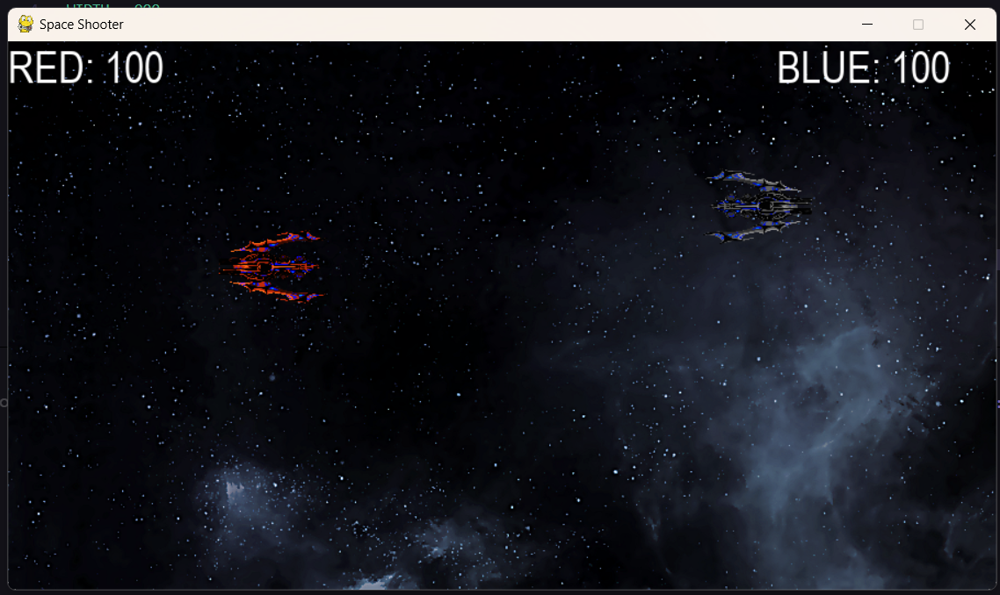
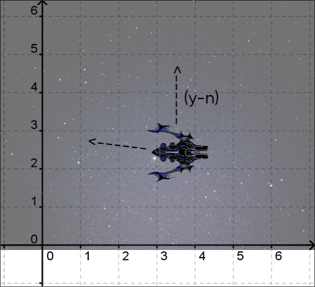

# SPACE SHOOTER GAME

This is a space shooter game for two players.
The game contains two ships which will shoot bullets and the opponent have to dodge and shoot back.

Very basic easy to play game.

## Check this out

## Basic Logic

I have used the python pygame library for development.
The basic idea is by pressing up, down, left, right arrow the player will move the ships in the XY-axes. Up arrow means (y-1) that is the ship will go up on the axes.

Similarly, for the bullet (x+1) for the left ship and (x-1) for the right ship untill it reach the end or hit the ship.

## How to play?

- Download the zip

- Run main.py in terminal

- Red ship Controls: W,A,S,D and LCtrl to Shoot
- Blue ship Controls: Up,Down,Left,Right arrow and RCtrl to shoot